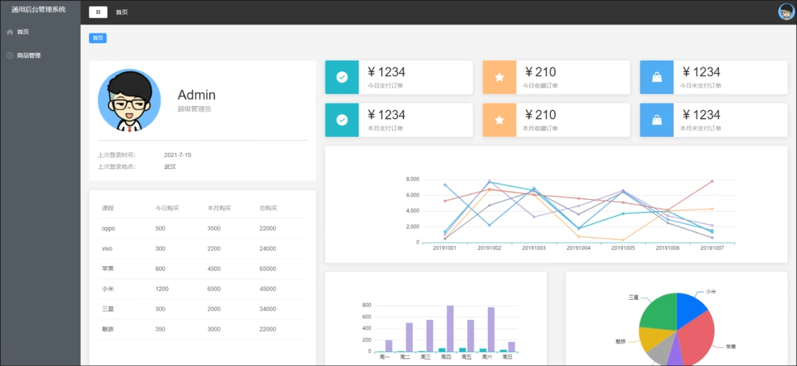
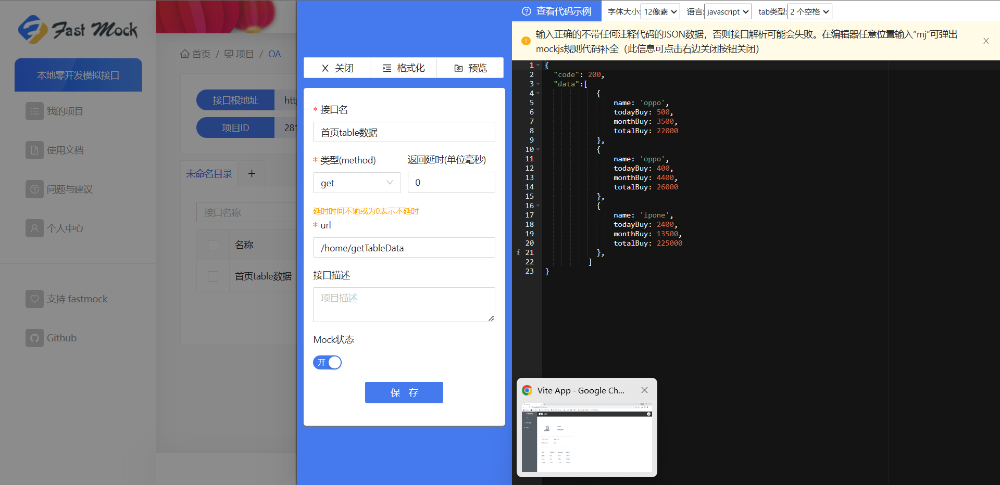
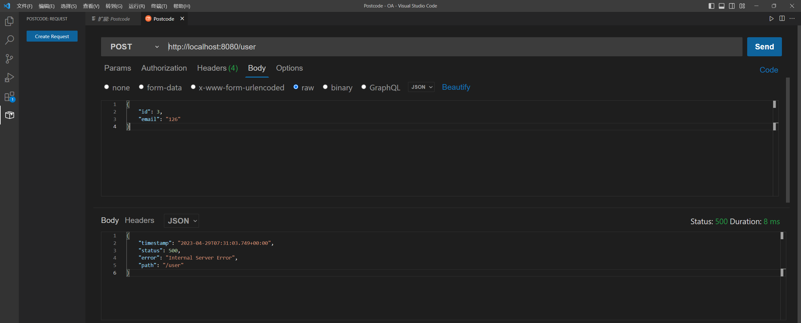
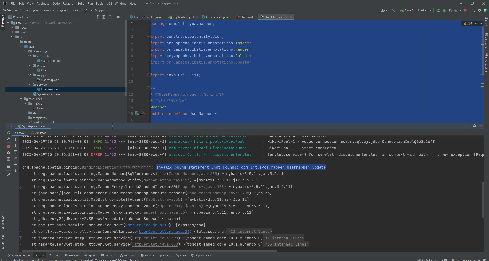
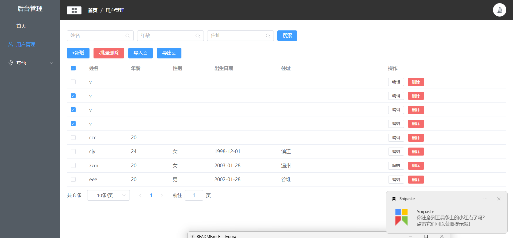

# Vue3

## 准备工作

- vite创建vue项目
- main.js 引入elementplus

## 分析页面结构



- 左侧和头部是侧边栏，且不随url变化而变化，用两个组件实现，同时挂载到根路由上
- 中间是随url变化的，目前界面内是个人中心，可以设置一个跟路由的子路由，切换中心界面

## 配置router

- ```js
  /router 文件夹main.js文件/
  import { createRouter, createWebHashHistory } from 'vue-router'
  import HomeView from '../views/HomeView.vue'
  
  const routes = [
    {
      path: '/',
      component: () => import('../views/Main.vue'),
      children: [
        {
          path: '/',
          name: 'home',
          component: () => import('../views/home/Home.vue')
        }
      ]
    }
  ]
  
  const router = createRouter({
    history: createWebHashHistory(),
    routes
  })
  
  export default router
  ```

- ```vue
  / App.vue文件 /
  <script setup>
  import { RouterLink, RouterView } from 'vue-router'
  </script>
  
  <template>
    <RouterView />
  </template>
  
  <style scoped>
  </style>
  ```

- ```vue
  /home 文件夹下 Home.vue文件 / 
  <template>
      <div>
          我是home
      </div>
  </template>
  ```

## 使用vuex实现状态管理

- 第一步：安装vuex

  ```
  npm install vuex@next --save
  ```

- 第二步：src下创建store文件夹

- 第三步：在store文件夹下创建index.js文件，编写state和mutation

  ```js
  import { createStore } from 'vuex'
  
  export default createStore({
      state: {
          isCollapse: true // 控制侧边栏是否折叠
      },
      mutations: {
          updateIsCollapse(state, payload) {
              state.isCollapse = !state.isCollapse
          }
      }
  })
  ```

- 第四步：使用state和mutation

  - 使用state

    ```vue
    :collapse="$store.state.isCollapse"
    ```

  - 使用mutation更改state

    ```vue
    <script>
        import { useStore } from 'vuex'
        export default {
            setup() {
                let store = useStore()
                let handleCollapse = () => {
                    // 调用vuex中的mutations
                    store.commit("updateIsCollapse")
                }
    
                return {
                    handleCollapse
                }
            }
        }
    </script>
    ```

## 切换路由

- 第一步：侧边栏菜单中绑定clickMenu方法，传入item参数

  - ```vue
    <el-menu-item 
            :index="item.path" 
            v-for="item in noChildren()" 
            :key="item.path"
            @click="clickMenu(item)"
           	>
    ```

- 第二步：组件中引入useRouter，实现clickMenu方法

  - ```vue
    <script>
        import { useRouter } from "vue-router"
        export default {
            setup() {
                let router = useRouter()
                // 点击菜单选项切换路由
                const clickMenu = (item) => {
                    router.push({
                        name: item.name
                    })
                }
                return {
                    clickMenu
                }
            }
        }
    </script>
    ```

- 第三步：编写组件，并在router文件夹中的index.js配置路由

  - ```js
    import { createRouter, createWebHashHistory } from 'vue-router'
    const routes = [
          {
            path: '/',
            component: () => import('../views/Main.vue'),
            redirect: '/home',
            children: [
              {
                path: '/home',
                name: 'home',
                component: () => import('../views/home/Home.vue')
              },
              {
                path: '/user',
                name: 'user',
                component: () => import('../views/user/User.vue')
              },
              {
                path: '/page1',
                name: 'page1',
                component: () => import('../views/Page1.vue')
              },
              {
                path: '/page2',
                name: 'page2',
                component: () => import('../views/Page2.vue')
              }
            ]
          }
        ]
    
    ```


​    
​    const router = createRouter({
​      history: createWebHashHistory(),
​      routes
​    })
​    
​    export default router
​    ```


## home组件ui编写

- element-plus 栅格布局和卡片ui

  ```vue
  <template>
      <el-row :gutter="20">
          <el-col :span="8" style="margin-top: 20px;">
              <el-card shadow="hover">
                  <div class="user-">
                      
                      <div class="user-info">
                          <p class="name">Admin</p>
                          <p class="role">超级管理员</p>
                      </div>
                      <div class="login-info">
                          <p>上次登录时间:<span>2023.3.25</span></p>
                          <p>上次登录地点:<span>杭州</span></p>
                      </div>
                  </div>
              </el-card>
          </el-col>
          <el-col :span="16" style="margin-top: 20px;">
          </el-col>
      </el-row>
  </template>
  ```

- element-plus表格使用

  ```vue
  <el-table :data="tableData">
      <el-table-column
                       v-for="(value, key) in tableLabel"
                       :key="key"
                       :prop="key"
                       :label="value"
                       ></el-table-column>
  </el-table>
  <script>
  export default {
      setup() {
          const tableData = [
              {
                  name: 'oppo',
                  todayBuy: 500,
                  monthBuy: 3500,
                  totalBuy: 22000
              },
              {
                  name: 'oppo',
                  todayBuy: 400,
                  monthBuy: 4400,
                  totalBuy: 26000
              },
              {
                  name: 'ipone',
                  todayBuy: 2400,
                  monthBuy: 13500,
                  totalBuy: 225000
              },
          ]
          const tableLabel = {
              name: "手机",
              todayBuy: "今日购买",
              monthBuy: "本月购买",
              totalBuy: "总购买"
          }
          return {
              tableData,
              tableLabel
          }
      }
  }
  </script>
  ```

## axios和在线fastmock模拟后端

- 第一步：安装axios

- 第二步：引入axios，onMounted,ref

- 第三步：fastmock网站编辑接口

  - 

- 第四步：准备axios函数发送ajax请求（url从fastmock网站获取），组件挂载时调用发送请求函数

  - ```vue
    <script>
    
    import axios from 'axios' // 引入axios
    import { defineComponent, onMounted, ref } from 'vue'
    export default {
        setup() {
            const tableData = ref([]) // 响应式
            const tableLabel = {
                name: "手机",
                todayBuy: "今日购买",
                monthBuy: "本月购买",
                totalBuy: "总购买"
            }
    
            // 发送ajax请求 同时注意连接后端后tableData要用ref改为响应式
            const getTableList = async () => {
                await axios.get("https://www.fastmock.site/mock/2813bf740c0964d8e2d621f759a85982/api/home/getTableData").then((res)=>{
                    if(res.data.code == 200){
                        tableData.value = res.data.data
                    }
                })
            } 
            // 组件挂载时调用发送请求函数
            onMounted(() => {
                getTableList()  
            })
            return {
                tableData,
                tableLabel
            }
        }
    }
    </script>
    ```

## 二次封装axios

-  第一步：在src目录下新建config目录，新建index.js文件编写配置

  ```js
  // 环境配置文件
  // 一般企业级项目中有三种环境
  // 开发环境
  // 测试环境
  // 线上环境
  
  // 当前的环境 如果取不到的话默认为线上环境prod
  const env = import.meta.env.MODE || 'prod'
  
  const EnvConfig = {
      development: {
          baseApi: '/api',
          mockApi: 'https://www.fastmock.site/mock/2813bf740c0964d8e2d621f759a85982/api',
      },
      test: {
          baseApi: '/api',
          mockApi: 'https://www.fastmock.site/mock/2813bf740c0964d8e2d621f759a85982/api',
      },
      prod: {
          baseApi: '//future.com/api',
          mockApi: 'https://www.fastmock.site/mock/2813bf740c0964d8e2d621f759a85982/api',
      },
  }
  
  export default {
      env,
      // mock的总开关，默认开启
      mock: true,
      ...EnvConfig[env]
  }
  ```

- 第二步：新建api目录，新建request.js文件，封装axios函数，（以后会做token拦截）

  ```js
  import axios from "axios";
  import config from "../config"
  import { ElMessage } from "element-plus";
  const NETWORK_ERROR = '网络请求异常，请稍后重试......'
  // 创建一个axios实例对象
  const service = axios.create({
      baseURL: config.baseApi
  })
  
  // 在请求之前做一些事情
  
  service.interceptors.request.use((req) => {
      // 可以自定义header
      // jwt-token认证的时候
      return req
  })
  
  // 在请求之后做一些事情
  
  service.interceptors.response.use((res) => {
      const { code, data, msg } = res.data
      if(code == 200){
          return data
      }else {
          // 网络请求错误
          ElMessage.error( msg || NETWORK_ERROR)
          return Promise.reject(msg || NETWORK_ERROR)
      }
  })
  
  // 封装的核心函数
  function request(options) {
      // 如果没有指定请求类型，则默认是get
      options.method = options.method || 'get'
      if (options.method.toLowerCase() == 'get'){
          options.params = options.data
      }
      // 对mock的处理
      // 单个接口可选择是否开启mock
      let isMock = config.mock
      if (typeof options.mock !== "undefined") {
          isMock = options.mock
      }
      // 对线上环境做处理
      if (config.env == "prod") {
          // 不给用到mock的机会
          service.defaults.baseURL = config.baseApi
      } else {
          service.defaults.baseURL = isMock ? config.mockApi : config.baseApi
      }
  
      return service(options)
  }
  
  export default request
  ```

- 第三步：在api目录下新建api.js文件实现整个项目api的管理

  ```js
  // 整个项目api的管理
  import request from "./request";
  export default {
      // home组件 左侧表格数据获取
      getTableData(params) {
          return request({
              url: '/home/getTableData',
              method: 'get',
              data: params,
              mock: true // 这个接口mock开关开启 
          })
      }
  }
  ```

- 第四步：使用封装后的axios函数（例如在Home.vue中的getTableList函数中使用）

  ```js
  import { defineComponent, getCurrentInstance, getCurrentScope,onMounted, ref } from 'vue'
         const { proxy } = getCurrentInstance() // proxy 类似vue2 中this
  
  // 发送ajax请求 同时注意连接后端后tableData要用ref改为响应式
          const getTableList = async () => {
              // await axios.get("https://www.fastmock.site/mock/2813bf740c0964d8e2d621f759a85982/api/home/getTableData").then((res)=>{
              //     if(res.data.code == 200){
              //         tableData.value = res.data.data
              //     }
              // })
              let res = await proxy.$api.getTableData() // 使用自己二次封装的axios
              tableData.value = res
          }
  ```

## 使用api三部曲（countdata为例）

- 准备：在mock中准备好接口

- 第一步：api.js文件中注册request函数

  - ```js
    // 整个项目api的管理
    
    import request from "./request";
    export default {
        // home组件 左侧表格数据获取
        getTableData(params) {
            return request({
                url: '/home/getTableData',
                method: 'get',
                data: params,
                mock: true
            })
        },
        // home 组件 右侧count数据获取
        getCountData(params) {
            return request({
                url: '/home/getCountData',
                method: 'get',
                data: params,
                mock: true
            })
        }
    }
    ```

- 第二步：组件中创建响应式对象和编写并调用函数实现数据渲染，记得setup函数中返回响应式对象

  ```js
  let countData = ref([])
  
  const getCountData = async () => {
      let res = await proxy.$api.getCountData()
      countData.value = res
  }
  
  // 组件挂载时调用发送请求函数
  onMounted(() => {
      getTableList()
      getCountData()  
  })
  return {
              tableData,
              tableLabel,
              countData
          }
  ```

  

# Spring Boot

## 新建SpringBoot项目

- 选择web，mybatis，sysql驱动，lombok（通过注解简化get/set...方法的java库）依赖

## 配置数据库连接

- application.yml文件

  ```yaml
  spring:
    datasource:
      driver-class-name: com.mysql.cj.jdbc.Driver
      url: jdbc:mysql://localhost:3306/oa?serverTimezone=GMT%2b8
      username: root
      password: 1234
  ```

## 测试数据库是否联通

- mysql新建表

  ```sql
  -- ----------------------------
  -- Table structure for sys_user
  -- ----------------------------
  DROP TABLE IF EXISTS `sys_user`;
  CREATE TABLE `sys_user`  (
    `id` int(11) NOT NULL AUTO_INCREMENT COMMENT 'ID',
    `username` varchar(50) CHARACTER SET latin1 COLLATE latin1_swedish_ci NULL DEFAULT NULL COMMENT '用户名',
    `password` varchar(50) CHARACTER SET latin1 COLLATE latin1_swedish_ci NULL DEFAULT NULL COMMENT '密码',
    `nickname` varchar(50) CHARACTER SET utf8 COLLATE utf8_general_ci NULL DEFAULT NULL COMMENT '昵称',
    `email` varchar(50) CHARACTER SET latin1 COLLATE latin1_swedish_ci NULL DEFAULT NULL COMMENT '邮箱',
    `phone` varchar(20) CHARACTER SET latin1 COLLATE latin1_swedish_ci NULL DEFAULT NULL COMMENT '电话',
    `create_time` timestamp(0) NULL DEFAULT CURRENT_TIMESTAMP(0) COMMENT '创建时间',
    PRIMARY KEY (`id`) USING BTREE
  ) ENGINE = InnoDB AUTO_INCREMENT = 2 CHARACTER SET = latin1 COLLATE = latin1_swedish_ci ROW_FORMAT = Dynamic;
  
  -- ----------------------------
  -- Records of sys_user
  -- ----------------------------
  INSERT INTO `sys_user` VALUES (1, 'admin', 'admin', '管理员', 'admin@qq.com', '123456', '2023-04-27 22:30:56');
  
  SET FOREIGN_KEY_CHECKS = 1;
  ```

- 新建实体类

  entity/User

  ```java
  package com.lrt.syoa.entity;
  
  import lombok.Data;
  
  @Data // 使用lombok注解自动生成getter/setter方法
  public class User {
      private Integer id;
      private String username;
      private String password;
      private String nickname;
      private String email;
      private String phone;
  
  }
  ```

- 新建Mapper接口

  mapper/UserMapper

  ```java
  package com.lrt.syoa.mapper;
  
  import com.lrt.syoa.entity.User;
  import org.apache.ibatis.annotations.Mapper;
  import org.apache.ibatis.annotations.Select;
  
  import java.util.List;
  
  /*
  * 把UserMapper这个Dao交给Spring管理
  * 自动生成实现类*/
  @Mapper
  public interface UserMapper {
  
      @Select("select * from sys_user")
      List<User> findAll();
  
  }
  ```

- Controller中编写处理器方法

  新建controller/UserController

  ```java
  package com.lrt.syoa.controller;
  
  import com.lrt.syoa.entity.User;
  import com.lrt.syoa.mapper.UserMapper;
  import org.springframework.beans.factory.annotation.Autowired;
  import org.springframework.web.bind.annotation.GetMapping;
  import org.springframework.web.bind.annotation.RestController;
  
  import java.util.List;
  
  /*=@Controller+@ResponseBody*/
  @RestController
  public class UserController {
  
  
      /*自动装配，找到userMapper的实现类并注入*/
      @Autowired
      private UserMapper userMapper;
  
      /*将请求和处理请求的映射器方法关联起来
       * 建立映射关系
       * get方式*/
      @GetMapping("/")
      public List<User> index() {
          return userMapper.findAll();
      }
  
  
  }
  
  ```
  
- 启动服务器发现测试成功

## mybatis实现增删改查

- 分析：增加和更新功能类似，都使用post方式向服务器提交User数据，唯一的区别是增加时不需要有id，更新是需要根据id更新数据

- 为了解耦，新建service层编写业务代码，controller中只调用service方法，这里调用UserService中的save方法

  ```java
  package com.lrt.syoa.controller;
  
  import com.lrt.syoa.entity.User;
  import com.lrt.syoa.mapper.UserMapper;
  import com.lrt.syoa.service.UserService;
  import org.springframework.beans.factory.annotation.Autowired;
  import org.springframework.web.bind.annotation.*;
  
  import java.util.List;
  
  /*=@Controller+@ResponseBody*/
  @RestController
  @RequestMapping("/user")
  public class UserController {
  
  
      /*自动装配，找到userMapper的实现类并注入*/
      @Autowired
      private UserMapper userMapper;
  
      @Autowired
      private UserService userService;
  
      @PostMapping
      public Integer save(@RequestBody User user){   // @RequestBody接收前端传递给后端的json字符 注意请求是post方式
          return userService.save(user);
      }
  
      /*将请求和处理请求的映射器方法关联起来
       * 建立映射关系
       * get方式*/
      @GetMapping
      public List<User> index() {
          return userMapper.findAll();
      }
      
      @DeleteMapping("/{id}")
      public Integer delete(@PathVariable Integer id){
          return userMapper.deleteById(id);
      }
  
  }
  ```

- 编写service，但是由于update数据时，如果请求中提交的User部分数据为空，如下图中只有email的数据，如果还使用注解方式写静态sql的话，会导致将id为3的字段中email数据修改后，此字段的其他数据被修改为null的情况，而我们的需求很明显是只修改email的数据

  

- 所以我们要采用xml方式编写动态sql的方式来判断前端给的数据是否为空，为空则不修改原本数据

  在resources目录下新建mapper/User.xml文件，注意命名空间要与接口的全路径一致，id要和接口中的方法名一致

  ```xml
  <?xml version="1.0" encoding="UTF-8" ?>
  <!DOCTYPE mapper PUBLIC "-//mybatis.org//DTD Mapper 3.0//EN"
          "http://mybatis.org/dtd/mybatis-3-mapper.dtd">
  <mapper namespace="com.lrt.syoa.mapper.UserMapper">
  
      <update id="update">
          update sys_user
          <set>
              <if test="username != null">
                  username = #{username},
              </if>
              <if test="nickname != null">
                  nickname = #{nickname},
              </if>
              <if test="email != null">
                  email = #{email},
              </if>
              <if test="phone != null">
                  phone = #{phone}
              </if>
          </set>
          <where>
              id = #{id}
          </where>
      </update>
      
  </mapper>
  ```

- 接口文件UserMapper代码如下

  ```java
  package com.lrt.syoa.mapper;
  
  import com.lrt.syoa.entity.User;
  import org.apache.ibatis.annotations.Insert;
  import org.apache.ibatis.annotations.Mapper;
  import org.apache.ibatis.annotations.Select;
  import org.apache.ibatis.annotations.Update;
  
  import java.util.List;
  
  /*
  * 把UserMapper这个Dao交给Spring管理
  * 自动生成实现类*/
  @Mapper
  public interface UserMapper {
  
      @Select("select * from sys_user")
      List<User> findAll();
  
      @Insert("insert into sys_user(username, password, nickname, email, phone) VALUES (#{username}, #{password}, " +
              "#{nickname}, #{email}, #{phone})")
      int insert(User user);
  
      int update(User user);
      
      @Delete("delete from sys_user where id = #{id}")
      Integer deleteById(@Param("id") Integer id);
  
  }
  ```

- 此时运行发现报错

  

- 发现是xml文件没有交给springboot去扫描

  在springboot配置文件中添加一下配置即可，顺便再加上mybatis的日志文件

  ```yaml
  mybatis:
    mapper-locations: classpath:mapper/*.xml
    configuration:
      log-impl: org.apache.ibatis.logging.stdout.StdOutImpl
  ```

  

## 自写分页查询

- ```java
  @Select("select * from sys_user limit #{pageNum}, #{pageSize}")
  List<User> selectPage(@Param("pageNum") Integer pageNum,@Param("pageSize") Integer pageSize);
  
  @Select("select count(*) from sys_user")
  Integer selectTotal();
  ```

- ```java
  // 接口路径：/user/page
  // @RequestParam接受 ?pageNum=1&pageSize=10
  @GetMapping("/page")
  public Map<String, Object> findPage(@RequestParam Integer pageNum, @RequestParam Integer pageSize) {
      Map<String, Object> res = new HashMap<>();
      pageNum = (pageNum - 1) * pageSize;
      List<User> userList = userMapper.selectPage(pageNum, pageSize);
      res.put("userList", userList);
      Integer total = userMapper.selectTotal();
      res.put("total", total);
      return res;
  }
  ```

## 跨域设置

- 在src下新建config/CorsConfig.java

- ```java
  package com.lrt.syoa.config;
  import org.springframework.context.annotation.Bean;
  import org.springframework.context.annotation.Configuration;
  import org.springframework.web.cors.CorsConfiguration;
  import org.springframework.web.cors.UrlBasedCorsConfigurationSource;
  import org.springframework.web.filter.CorsFilter;
  
  @Configuration
  public class CorsConfig {
  
      // 当前跨域请求最大有效时长。这里默认1天
      private static final long MAX_AGE = 24 * 60 * 60;
      @Bean
      public CorsFilter corsFilter() {
          UrlBasedCorsConfigurationSource source = new UrlBasedCorsConfigurationSource();
          CorsConfiguration corsConfiguration = new CorsConfiguration();
          corsConfiguration.addAllowedOrigin("http://localhost:8080"); // 1 设置访问源地址
          corsConfiguration.addAllowedHeader("*"); // 2 设置访问源请求头
          corsConfiguration.addAllowedMethod("*"); // 3 设置访问源请求方法
          corsConfiguration.setMaxAge(MAX_AGE);
          source.registerCorsConfiguration("/**", corsConfiguration); // 4 对接口配置跨域设置
          return new CorsFilter(source);
      }
  }
  ```

  


- 忽略某个字段名，不展示给前端

  ```java
  @JsonIgnore
  ```

## 集成Mybatis-plus

  - ```xml
    <dependency>
        <groupId>com.baomidou</groupId>
        <artifactId>mybatis-plus-boot-starter</artifactId>
        <version>3.5.1</version>
    </dependency>
    ```
  
  - config/MybatisPlusConfig.java
  
    ```java
    package com.lrt.syoa.config;
    
    import com.baomidou.mybatisplus.annotation.DbType;
    import com.baomidou.mybatisplus.extension.plugins.MybatisPlusInterceptor;
    import com.baomidou.mybatisplus.extension.plugins.inner.PaginationInnerInterceptor;
    import org.mybatis.spring.annotation.MapperScan;
    import org.springframework.context.annotation.Bean;
    import org.springframework.context.annotation.Configuration;
    
    @Configuration
    @MapperScan("com.lrt.syoa.mapper")
    public class MybatisPlusConfig {
    
        @Bean
        public MybatisPlusInterceptor mybatisPlusInterceptor() {
            MybatisPlusInterceptor interceptor = new MybatisPlusInterceptor();
            interceptor.addInnerInterceptor(new PaginationInnerInterceptor(DbType.MYSQL));
            return interceptor;
        }
    
    }
    ```


## 集成swagger

## 手写完整分页查询和多条件查询

- 前端：接受用户输入的current-size和page-size，发送get请求传参给后端
- 后端：接收前端的参数，计算pageNum和pageSize，改变sql语句limit参数查询数据库
- 多条件查询无非是多加几个请求参数罢了

-   前端

  ```vue
  <template>
      <div class="search" style="padding: 10px 0;">
          <el-input :suffix-icon="Search" style="width: 200px" placeholder="姓名" v-model="name"/>
          <el-input :suffix-icon="Search" style="width: 200px; margin-left: 10px;" placeholder="年龄" v-model="age"/>
          <el-input :suffix-icon="Search" style="width: 200px; margin-left: 10px;" placeholder="住址" v-model="addr"/>
          <el-button style="margin-left: 10px;" type="primary" @click="getPeoList">搜索</el-button>
      </div>
      <div class="user-header" style="margin: 10px 0;">
          <el-button type="primary">+新增</el-button>
          <el-button type="danger">-批量删除</el-button>
          <el-button type="primary">导入<el-icon>
                  <Upload />
              </el-icon></el-button>
          <el-button type="primary">导出<el-icon>
                  <Download />
              </el-icon></el-button>
      </div>
      <div class="table">
          <el-table :data="list" style="width: 100%">
              <el-table-column v-for="item in tableLabel" :key="item.prop" :label="item.label" :prop="item.prop"
                  :width="item.width ? item.width : 125" />
              <el-table-column fixed="right" label="操作" min-width="180">
                  <template #default>
                      <el-button size="small" @click="handleClick">编辑</el-button>
                      <el-button type="danger" size="small">删除</el-button>
                  </template>
              </el-table-column>
          </el-table>
      </div>
      <div style="padding: 10px 0">
          <el-pagination v-model:page-size="pageSize" v-model:current-page="pageNum" :total="total"
              layout="total, sizes, prev, pager, next, jumper" @size-change="handleSizeChange"
              @current-change="handleCurrentChange" />
      </div>
  </template>
  
  <script>
      import { getCurrentInstance } from 'vue'
      import { onMounted, ref, reactive } from 'vue'
      import { Search } from '@element-plus/icons-vue'
  
      export default {
          setup() {
              const { proxy } = getCurrentInstance()
              const list = ref([])
              const pageNum = ref(1)
              const pageSize = ref(2)
              const total = ref(10)
              const name = ref()
              const age = ref()
              const addr = ref()
              const tableLabel = reactive([
                  {
                      prop: "name",
                      label: "姓名"
                  },
                  {
                      prop: "age",
                      label: "年龄"
                  },
                  {
                      prop: "sex",
                      label: "性别"
                  },
                  {
                      prop: "birth",
                      label: "出生日期",
                      width: 200
                  },
                  {
                      prop: "addr",
                      label: "住址",
                      width: 320
                  },
              ])
              onMounted(() => {
                  getPeoList();
              })
              const getPeoList = async () => {
                  let param = {
                      pageNum: pageNum.value,
                      pageSize: pageSize.value,
                      name: name.value,
                      age: age.value,
                      addr: addr.value
                  }
                  let res = await proxy.$api.getPeoList(param)
                  list.value = res.data.peoList
                  total.value = res.data.total
              }
              const handleSizeChange = (pagesize) => {
                  pageSize.value = pagesize
                  getPeoList()
              }
              const handleCurrentChange = (currentpage) => {
                  pageNum.value = currentpage
                  getPeoList()
              }
              return {
                  list,
                  tableLabel,
                  Search,
                  pageNum,
                  pageSize,
                  total,
                  name,
                  age,
                  addr,
                  handleSizeChange,
                  handleCurrentChange,
                  getPeoList
              }
          }
      }
  </script>
  
  <style>
  </style>
  ```

- 几个错误和解决方法

  - 1，因为前端不一定会传入name，age，addr这几个请求参数，所以Controller中要设置请求参数为可选，不然可能会报400错误

  - PeoController中加个参数即可

    ```java
    @RequestParam(required = false)
    ```

  - 2，还是多条件查询的几个参数，前端传过来的可能是空串或者是null，这时候后端如果还用静态sql的话就会报错

  - 同时如果xml中不指定resultType的话会报错，直接指定bean所在的全包名即可

  - resources新建Peo.xml中写动态sql

  - ```xml
    <?xml version="1.0" encoding="UTF-8" ?>
    <!DOCTYPE mapper PUBLIC "-//mybatis.org//DTD Mapper 3.0//EN"
            "http://mybatis.org/dtd/mybatis-3-mapper.dtd">
    <mapper namespace="com.lrt.syoa.mapper.PeoMapper">
    
        <select id="getList" resultType="com.lrt.syoa.entity.Peo">
            select * from sys_peo
            <where>
                <if test="name!=null and name!='' ">
                    name like concat("%",#{name},"%")
                </if>
                <if test="age!=null and age!='' ">
                    and age like concat("%",#{age},"%")
                </if>
                <if test="addr!=null and addr!='' ">
                    and addr like concat("%",#{age},"%")
                </if>
            </where>
            limit #{pageNum}, #{pageSize}
        </select>
    
    </mapper>
    ```


## vue中的增删改查

- 增加功能：点击增加按钮弹出一个模态框，里面包含人员信息相关的表单，点击确认后将数据提交给后端即可

  ```vue
  <el-dialog v-model="dialogFormVisible" title="人员信息" width="30%">
          <el-form label-width="100px">
              <el-form-item label="姓名">
                  <el-input v-model="form.name" autocomplete="off" />
              </el-form-item>
              <el-form-item label="年龄">
                  <el-input v-model="form.age" autocomplete="off" />
              </el-form-item>
              <el-form-item label="性别">
                  <el-radio-group v-model="form.sex">
                      <el-radio label="男" />
                      <el-radio label="女" />
                  </el-radio-group>
              </el-form-item>
              <el-form-item label="出生日期">
                  <el-date-picker v-model="form.birth" type="date" placeholder="请选择你的出生日期" style="width: 100%" />
              </el-form-item>
              <el-form-item label="住址">
                  <el-input v-model="form.addr" autocomplete="off" />
              </el-form-item>
          </el-form>
          <template #footer>
              <span class="dialog-footer">
                  <el-button @click="dialogFormVisible = false">取消</el-button>
                  <el-button type="primary" @click="addPeo();dialogFormVisible = false">
                      确认
                  </el-button>
              </span>
          </template>
  </el-dialog>
  const addPeo = async () => {
          let param = {
              name: form.name,
              age: form.age,
              sex: form.sex,
              birth: form.birth,
              addr: form.addr
          }
          let res = await proxy.$api.savePeo(param)
          if (res.data == 1) {
              alert("success")
              getPeoList()
          }
          else {
          	alert("fail")
         	}
  }
  ```

- 更新功能：点击编辑按钮，将其所在行的数据赋给form，然后打开模态框（和增加功能共用一个模态框），同样点击提交将数据传给后端

  - 如果先点编辑提交后，再使用新增功能，会怎样呢？
  - 因为我们使用的是同一个响应式属性form,如果先点编辑，那么form中的id属性被赋值，再使用新增功能的时候会将编辑的id一起传过去，后台就会判断为update，等于没有实现新增，又重新编辑了一遍数据

  - 解决方案：我们应该在前端就判断一下是编辑还是新增，如果是编辑请求参数再加上id，为了解耦和增加代码重用性的需要，我们设计了标记isEdit，其默认值为false，当使用编辑按钮打开模态框时，其值变为true，即此时然后在addPeo中判断，如果isEdit.value == true就加上请求参数id。最后，在请求发送完成后，重新将isEdit设为false，避免下次新增数据提交了id

  - ```js
    <el-table-column fixed="right" label="操作" min-width="180">
        <template v-slot="scope">
            <el-button size="small" @click="editPeo(scope.row)">编辑</el-button>
    		<el-button type="danger" size="small">删除</el-button>
        </template>
    </el-table-column>
    const addPeo = async () => {
        const isEdit = ref(false) // 判断是编辑还是新增
        let param = {
            name: form.value.name,
            age: form.value.age,
            sex: form.value.sex,
            birth: form.value.birth,
            addr: form.value.addr
        }
        // 如果是编辑的话，就在请求参数中加上id
        if(isEdit.value == true){
            param.id = form.value.id
        } 
        let res = await proxy.$api.savePeo(param)
        if (res.data == 1) {
            ElMessage({
                message: '保存成功',
                type: 'success',
            })
            getPeoList()
        }
        else {
            ElMessage.error('保存失败')
        }
        isEdit.value = false // 将isEdit重置为false,避免下次新增数据提交了id
    }
    const editPeo = async (row) => {
        form.value = JSON.parse(JSON.stringify(row)) // 将行中的数据赋给form JSON.parse(JSON.stringify(row))使双向绑定暂时失效
        isEdit.value = true
        dialogFormVisible.value = true
    }
    ```

- 删除功能：点击删除按钮，传递id给后端，后端根据id删除数据库字段

  - 小问题

  - 前端如果用axios封装的delete请求，又用的是axios默认的**{data : param}**传参的话，参数会在请求的payload中，后端需要通过 @RequestBody 接参，

    需要封装一个MessageId类来接受id参数

  - ```java
    @DeleteMapping("/delete")
        public Integer delete(@RequestBody MessageId id) {
            return peoMapper.deleteById(id.getId());
        }
    ```

  - ```java
    package com.lrt.syoa.entity;
    
    import lombok.Data;
    
    @Data
    public class MessageId {
        private Integer id;
    }
    ```

- 批量删除

  - 功能描述：选择记录前的多选框，点击批量删除按钮，删除数据

  - 

  - 点击多选框后，前端获取选中的数据中的ids数组，传给后端，后端service调用delete mapper删除数据

  - 前端需要判断ids数组是否为空，避免发送多余请求

  - ```js
    const handleSelectionChange = (val) => {
        mutiSelection.value = val
    }
    // 点击批量删除按钮
    const batchDelete = async () => {
    // 转换为id数组
        const ids = mutiSelection.value.map(v => v.id)
        	if (ids.length > 0){
                let res = await proxy.$api.batchDel(ids);
                if (res.data == ids.length){
                    ElMessage({
                    message: '批量删除成功',
                    type: 'success',
                    })
                    getPeoList()
        	}
        }
    }
    ```

  - ```java
    @DeleteMapping("/batchDel")
    public Integer batch(@RequestBody List<Integer> ids){
    	return peoService.batchDel(ids);
    }
    
    public Integer batchDel(List<Integer> ids) {
        Integer num = 0;
        for (Integer id : ids) {
        	num += peoMapper.deleteById(id);
        }
        return num;
    }
    ```

    

## 实现导入导出

- 引入hutool[入门和安装 (hutool.cn)](https://hutool.cn/docs/#/)

  ```xml
  <!--            hutool -->
          <dependency>
              <groupId>cn.hutool</groupId>
              <artifactId>hutool-all</artifactId>
              <version>5.8.16</version>
          </dependency>
          <dependency>
              <groupId>org.apache.poi</groupId>
              <artifactId>poi-ooxml</artifactId>
              <version>4.1.2</version>
          </dependency>
  ```

- 实现导出：

  - 后端：利用hutool ExcelUtil工具类，从数据库中查询所有数据，写入到输出流中即可；
  - 前端：导出按钮绑定函数window.open后端接口，以下是service中的代码

  ```java
  public void export(HttpServletResponse response) throws IOException {
          // 从数据库中查询出所有数据
          List<Peo> peoList = peoMapper.findAll();
          // 在内存操作 写出到浏览器
          ExcelWriter writer = ExcelUtil.getWriter("true");
          // 一次性写出内容，使用默认样式，强制输出标题
          writer.write(peoList, true);
          //response为HttpServletResponse对象
          response.setContentType("application/vnd.ms-excel;charset=utf-8");
          String filename = URLEncoder.encode("人员名单", "UTF-8");
          //test.xls是弹出下载对话框的文件名，不能为中文，中文请自行编码
          response.setHeader("Content-Disposition","attachment;filename="+filename+".xls");
          ServletOutputStream out = response.getOutputStream();
  
          writer.flush(out, true);
          //此处记得关闭输出Servlet流
          out.close();
          // 关闭writer，释放内存
          writer.close();
      }
  ```

- 导入：

  - 后端：接收Post请求参数MultipartFile，获取文件输入流，同样用hutool提供的ExcelUtil工具类通过javabean的方式读取excel中数据

    ```java
    @PostMapping("/import")
        public boolean imp(MultipartFile file) throws Exception{
            InputStream inputStream = file.getInputStream();
            ExcelReader reader = ExcelUtil.getReader(inputStream);
            // 通过javabean的方式读取excel数据, 要求必须要和javabean中的属性对应起来
            List<Peo> list = reader.readAll(Peo.class);
            peoService.saveBatch(list);
            return true;
        }
    ```

    

  - 前端：使用element-plus的upload组件，在action里指定后端接口即可

## 登录实现